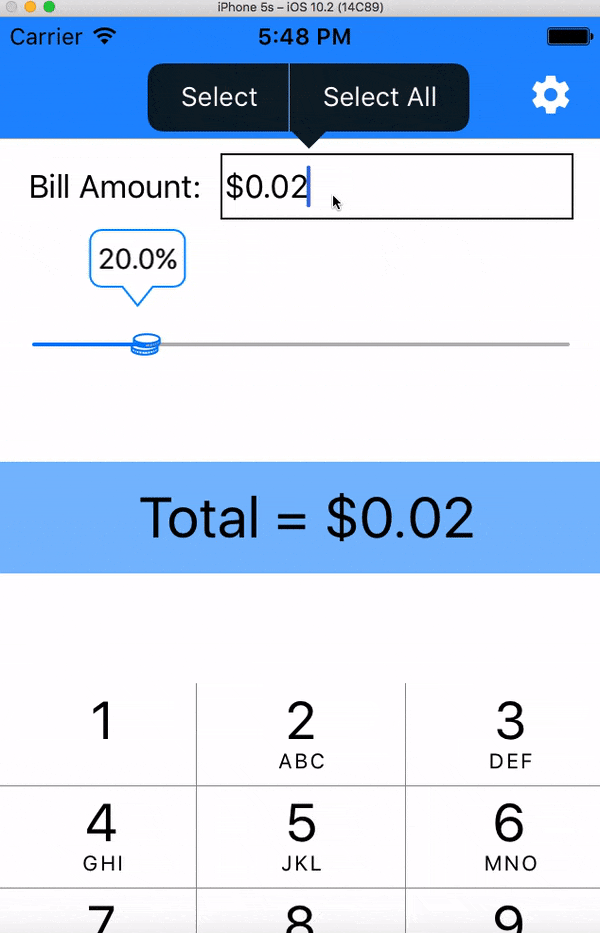

## Tip Calculator in Swift/iOS

**Name of your app** is a tip calculator application for iOS.

Submitted by: **Tony Wang**

Time spent: **3** hours spent in total

## User Stories

The following **required** functionality is completed:

* [x] User can enter a bill amount, choose a tip percentage, and see the tip and total values.
* [x] Settings page to change the default tip percentage.

The following **optional** features are implemented:
* [x] UI animations
* [x] Remembering the bill amount across app restarts (if <10mins)
* [x] Using locale-specific currency and currency thousands separators.
* [x] Making sure the keyboard is always visible and the bill amount is always the first responder. This way the user doesn't have to tap anywhere to use this app. Just launch the app and start typing.

The following **additional** features are implemented:
* User Settings page allow user to **override** the locale currency symbol, which has a validator for the number of characters, because one may want to use £ when he/she is in the UK even though their phone locale settings are USD $.

## Video Walkthrough

Here's a walkthrough of implemented user stories:

## Notes
* Implemented custom views/controls for code reuse throughout the app. For example, the custom **TipSlider** widget is used in two screens
* A custom label named **ScratchLabel** was created to allow user panning for incrementing/decrementing the total bill amount
* The delegate pattern is widely used across the app for event-driven UI updates
* Implemented singleton-based configuration and service structs, e.g. **DataManager** and **Configuration**
* User settings such as *Currency Symbol* and *Default tipping percentage* are saved in **Data.plist** file on the iOS device

## License
    The MIT License
    Copyright (c) [Tony Wang] https://github.com/rcholic/TipsCalculator

    Permission is hereby granted, free of charge, to any person obtaining a copy
    of this software and associated documentation files (the "Software"), to deal
    in the Software without restriction, including without limitation the rights
    to use, copy, modify, merge, publish, distribute, sublicense, and/or sell
    copies of the Software, and to permit persons to whom the Software is
    furnished to do so, subject to the following conditions:

    The above copyright notice and this permission notice shall be included in
    all copies or substantial portions of the Software.

    THE SOFTWARE IS PROVIDED "AS IS", WITHOUT WARRANTY OF ANY KIND, EXPRESS OR
    IMPLIED, INCLUDING BUT NOT LIMITED TO THE WARRANTIES OF MERCHANTABILITY,
    FITNESS FOR A PARTICULAR PURPOSE AND NONINFRINGEMENT. IN NO EVENT SHALL THE
    AUTHORS OR COPYRIGHT HOLDERS BE LIABLE FOR ANY CLAIM, DAMAGES OR OTHER
    LIABILITY, WHETHER IN AN ACTION OF CONTRACT, TORT OR OTHERWISE, ARISING FROM,
    OUT OF OR IN CONNECTION WITH THE SOFTWARE OR THE USE OR OTHER DEALINGS IN
    THE SOFTWARE.
