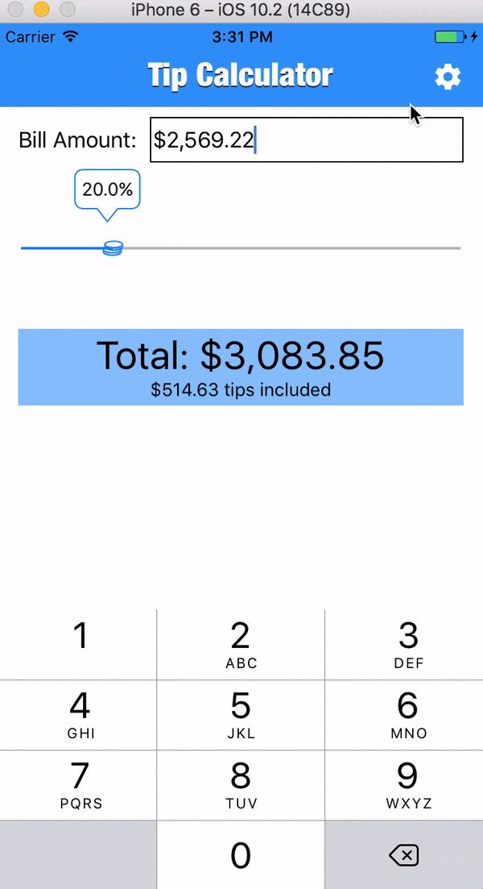

### Tip Calculator in Swift/iOS

#### Custom Views:
* ScratchLabel: allows user to increment/decrement the total amount by scratching left/right
* TipSlider: allows user to set the tipping percentage, calculating the total amount

#### Data Storage:
User settings such as *Currency Symbol* and *Default tipping percentage* are saved in **Data.plist** file on the iOS device

#### Requirements:
* XCode 8.2.1
* Swift 3

#### Features coming soon:
* Save paid bills and tips
* Anonymous sharing of the tipping percentage for the specified restaurant, serving as a reference for other customers

#### Screencast:

